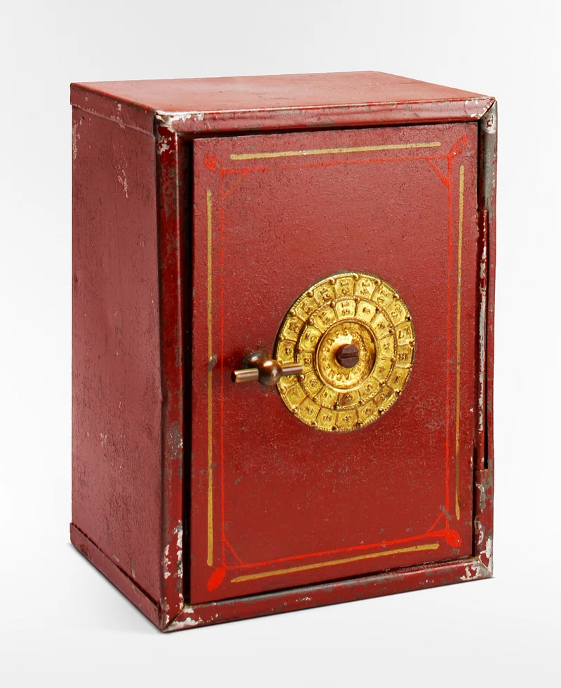
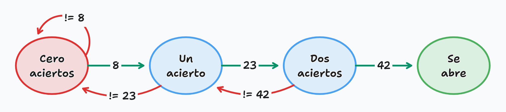

## Serie de Leibniz

En matemáticas, la serie de Leibniz es una serie infinita que sirve para calcular el número $\pi$ de forma aproximada.

$$
\sum_{n=0}^{\infty}\frac{(-1)^{n}}{2n+1}= 1 - \frac{1}{3} + \frac{1}{5} -\frac{1}{7} + \frac{1}{9} -\cdots = \frac{\pi}{4}
$$

Escribe un programa Python que calcule una aproximación de $\pi$ mediante la serie de Leibniz. El programa ha de solicitar al usuario un número entero positivo `n` y calcular la suma de los `n` primeros términos de la serie de Leibniz. Finalmente, calculará y mostrará: el valor aproximado, el valor real (puedes usar el valor de `math.pi`) y el error entre ellos.

| Número de términos:
| **0**
| Valor aproximado: 0
| Valor real:       3.141592653589793
| Error: 3.141592653589793

| Número de términos:
| **10**
| Valor aproximado: 3.0418396189294032
| Valor real:       3.141592653589793
| Error: 0.09975303466038987

| Número de términos:
| **100**
| Valor aproximado: 3.1315929035585537
| Valor real:       3.141592653589793
| Error: 0.00999975003123943

**Entrega:** Escribe tu programa en un fichero denominado `leibniz.py`.

## La caja fuerte del West Bank

Las cajas fuertes de dial (o de combinación) son un tipo de caja fuerte que se abre mediante la introducción de una secuencia de números. La caja fuerte del _West Bank_ se abre introduciendo tres números secretos (`8, 23, 42`).

- Si se acierta un número:
    - La caja emitirá un chasquido (_tick_),
    - y se podrá introducir el siguiente número.
- Si se falla en alguno:
    - La caja se reinicia emitiendo un sonido (_clonk_),
    - y tendrás que volver a empezar con el primer número.
- Si se aciertan los tres números seguidos, sin fallos:
    - La caja fuerte se abrirá.
    - Mensaje: `<se abre>`
- El usuario puede rendirse en cualquier momento introduciendo un `0`.

{ width=30% }

| Bienvenido al West Bank!
| \<frente a la caja fuerte\>
| **8**
| tick
| **23**
| tick
| **42**
| tick
| \<se abre\>

| Bienvenido al West Bank!
| \<frente a la caja fuerte\>
| **8**
| tick
| **1**
| clonk
| **8**
| tick
| **23**
| tick
| **42**
| tick
| \<se abre\>

| Bienvenido al West Bank!
| \<frente a la caja fuerte\>
| **1**
| clonk
| **2**
| clonk
| **0**
| \<se aleja caminando\>

 Diagrama de estados 

**Entrega:** Escribe tu programa en un fichero denominado `westbank.py`.

## Mano fuerte, mano débil

En el juego de "Mano fuerte, mano débil" se enfrentan dos jugadores. Cada uno recibe dos cartas de una baraja de póker.
El valor de cada carta viene dado por la siguiente tabla:

| 2-10 | J   | Q   | K   | A   |
| :--: | :-: | :-: | :-: | :-: |
| 2-10 | 11  | 12  | 13  | 14  |

Una mano **gana** a otra si ambas cartas son **superiores** a las del rival (no importa la posición de la carta)

- `14, 3` gana a `13, 2` (porque `14>13` y `3>2`)
- `14, 3` gana a `2, 13` (porque `14>13` y `3>2`)
- `14, 2` empata con `3, 3` (porque `14>3` y `2<3`)
- `8, 4` pierde con `14, 8` (porque `8<14` y `4<8`)
- `8, 4` empata con `8, 8` (porque `8=8` y `4<8`)

- Esto genera varias reglas implícitas:
    - Sacar un 14 (as) garantiza victoria o empate. (Ninguna mano puede ganarte porque, como mínimo, empatas).
    - Sacar un 2 (carta más baja) garantiza cero victorias. (Cualquier mano te gana o empata).

La siguiente tabla ilustra todas las combinaciones posibles para la mano `8, 10`.

|       | 2 | 3 | 4 | 5 | 6 | 7 | 8 | 9 | T | J | Q | K | A |
|   -   | - | - | - | - | - | - | - | - | - | - | - | - | - |
| **2** | o | o | o | o | o | o | o | o |   |   |   |   |   | 
| **3** | o | o | o | o | o | o | o | o |   |   |   |   |   | 
| **4** | o | o | o | o | o | o | o | o |   |   |   |   |   | 
| **5** | o | o | o | o | o | o | o | o |   |   |   |   |   | 
| **6** | o | o | o | o | o | o | o | o |   |   |   |   |   | 
| **7** | o | o | o | o | o | o | o | o |   |   |   |   |   | 
| **8** | o | o | o | o | o | o |   |   |   |   |   |   |   | 
| **9** | o | o | o | o | o | o |   |   |   | x | x | x | x | 
| **T** |   |   |   |   |   |   |   |   |   | x | x | x | x | 
| **J** |   |   |   |   |   |   |   | x | x | x | x | x | x | 
| **Q** |   |   |   |   |   |   |   | x | x | x | x | x | x | 
| **K** |   |   |   |   |   |   |   | x | x | x | x | x | x | 
| **A** |   |   |   |   |   |   |   | x | x | x | x | x | x |

Escribe un programa Python que, dada una mano de un jugador (introducidas como los dos puntos de cada carta), calcule **cuántas combinaciones ganan, cuántas empatan y cuántas pierden**.
**NO** has de tener en cuenta las probabilidades de que salga una carta, solo contar cuantas combinaciones ganan, empatan o pierden.

| Introduce la primera carta:
| **14**
| Introduce la segunda carta:
| **14**
| Victorias: 144
| Empates:   25
| Derrotas:  0

| Introduce la primera carta:
| **8**
| Introduce la segunda carta:
| **10**
| Victorias: 60
| Empates:   77
| Derrotas:  32

**Entrega:** Escribe tu programa en un fichero denominado `manofuerte.py`.

## Mano fuerte, mano débil (II)

**Partiendo del ejercicio anterior** (crea una copia del ejercicio una vez lo hayas acabado), **extiende** el funcionamiento del mismo añadiendo la representación de la tabla de casos. En dicha tabla:

- `o` indica que tu mano gana.
- `x` indica que tu mano pierde.
- `.` indica que tu mano empata.

_Tip:_ Recuerda lo aprendido en el ejercicio [Dibujar tablas de multiplicar](../../01_teoria/03_composicion/305_composicion_iterativa_for_II.qmd#ejercicio-dibujar-las-tablas-de-multiplicar)

<pre class="line-block">
Introduce la primera carta:
<b>8</b>
Introduce la segunda carta:
<b>10</b>

   | 2 | 3 | 4 | 5 | 6 | 7 | 8 | 9 | T | J | Q | K | A |
 2 | o | o | o | o | o | o | o | o | . | . | . | . | . |
 3 | o | o | o | o | o | o | o | o | . | . | . | . | . |
 4 | o | o | o | o | o | o | o | o | . | . | . | . | . |
 5 | o | o | o | o | o | o | o | o | . | . | . | . | . |
 6 | o | o | o | o | o | o | o | o | . | . | . | . | . |
 7 | o | o | o | o | o | o | o | o | . | . | . | . | . |
 8 | o | o | o | o | o | o | . | . | . | . | . | . | . |
 9 | o | o | o | o | o | o | . | . | . | x | x | x | x |
10 | . | . | . | . | . | . | . | . | . | x | x | x | x |
11 | . | . | . | . | . | . | . | x | x | x | x | x | x |
12 | . | . | . | . | . | . | . | x | x | x | x | x | x |
13 | . | . | . | . | . | . | . | x | x | x | x | x | x |
14 | . | . | . | . | . | . | . | x | x | x | x | x | x |

Victorias: 60
Empates:   77
Derrotas:  32
</pre>

Para evitar problemas con el programa de pruebas, utiliza el carácter «o» minúscula (`o`), «x» minúscula (`x`), punto (`.`) y pleca o barra vertical (`|`) al escribir la tabla.
La barra vertical se genera en los teclados con distribución española presionando las teclas `Alt Gr` + `1` del bloque alfanumérico.

**Entrega:** Escribe tu programa en un fichero denominado `manofuerte2.py`.

## Pruebas

Copia los archivos de pruebas de la práctica 3 en la carpeta `test` de la carpeta `p3` que creaste con la estructura básica de carpetas en la [práctica 0](../p0/101_introductoria.html#/22):

1. En tu carpeta de prácticas `FIIB`, accede a la carpeta `tests` de la carpeta `p3` y déjala abierta.
1. Descarga el fichero [`tests_p3.zip`](./tests_p3.zip).
1. Abre el archivo `tests_p3.zip` que te has descargado.
1. Arrastra todo el contenido del archivo `tests_p3.zip` a la carpeta `tests` de la carpeta `p3`.

Recuerda que, para poder ejecutar los test, tienes que abrir, en Visual Studio Code, la carpeta `p3` de tu carpeta de prácticas `FIIB`.
Hazlo seleccionando carpeta `p3` en el Explorador de Windows o en Finder y, con el botón derecho, elige el menú `Abrir directorio en VSCode`.
También puedes abrir primero Visual Studio Code y, desde allí, ir al menú `File` > `Open Folder` y seleccionar la carpeta `p3`.

Las pruebas que os proporcionamos en esta práctica son menos exigentes con el formato de la salida escrita en la pantalla que las de la práctica anterior. 
También son menos exhaustivas que en la práctica 1, por lo que es posible que, aunque tu programa pase todas las pruebas, no cumpla con todos los requisitos solicitados en el enunciado. Por ello, para asegurarte de que todos funcionan correctamente, ejecuta manualmente tus programas las veces que sea necesario con distintos datos de entrada para comprobar que funcionan correctamente en todos los casos y comprueba que el formato de la salida de tus programas es el solicitado en el enunciado.

En particular, las pruebas del programa `westbank.py` solo comprueba que las onomatopeyas _tick_ y _clonk_ aparecen en la secuencia correcta y las pruebas del programa `manofuerte2.py` solo comprueba que los caracteres `o`, `x` y `.` aparecen las veces correctas y en el orden adecuado.
No comprueba ningún otro aspecto del formato de la tabla, por lo que tendrás que ser tú quien se asegure de que esta aparece correctamente alineada al ejecutar el programa.

## Entrega de la práctica

**Antes de las 18:00 de la fecha límite establecida en Moodle,** deberán haberse subido a Moodle los siguientes ficheros:

- [ ] `leibniz.py`
- [ ] `westbank.py`
- [ ] `manofuerte.py`
- [ ] `manofuerte2.py`
